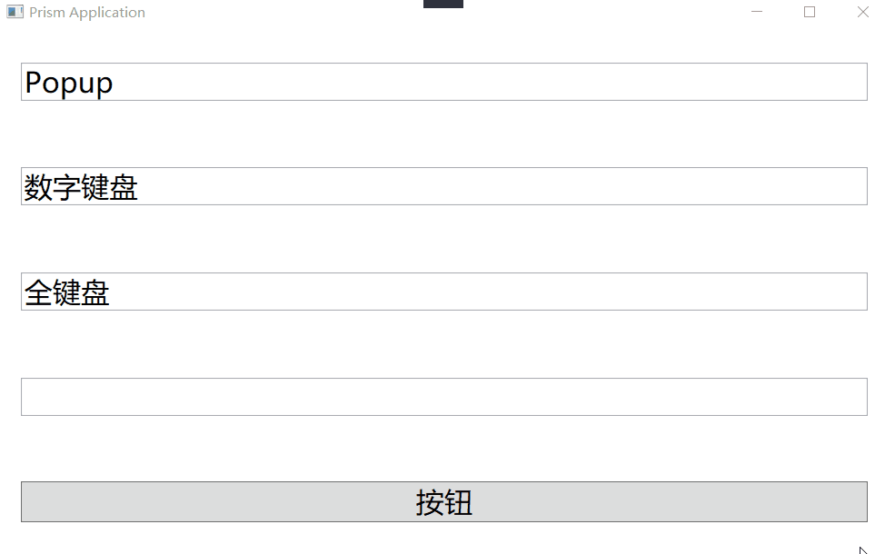
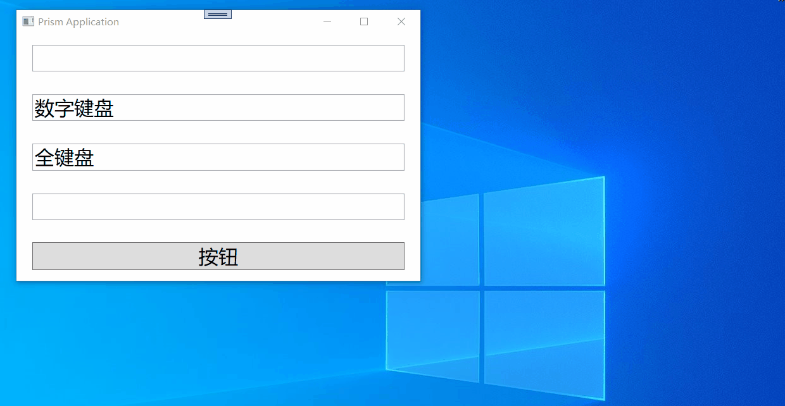

# KeyBoard.WPF

一款用于触摸屏输入的屏幕软键盘

# 开发信息

- NET6 + VS2022
- 使用WPF


# 支持功能

- 支持NET6，7，8，9及以上版本
- 支持Net Framework4.62
- 目前提供2个键盘可选，数字小键盘和全键盘，全键盘是可以打中文的，前提是你的电脑有安装中文包
- 使用的是WPF的行为，目前只能在WPF项目中使用
- 目前键盘只支持单键的按下、松开模拟，跟使用实体键盘一样，但是不支持组合键，且有些键盘上的特殊键（如PageUp等也不支持）
- 使用钩子函数模拟键盘的按下和松开，代码简单，可以自己下载源码编译为其他版本

# 快速使用

在XAML中先引入包的命名空间

```xaml
xmlns:i="http://schemas.microsoft.com/xaml/behaviors"
xmlns:keyboard="clr-namespace:KeyBoard.WPF.Behavior;assembly=KeyBoard.WPF"
```


## 小键盘（NumericKeyboardBehavior）

```xaml
<i:Interaction.Behaviors>
    <keyboard:NumericKeyboardBehavior/>
</i:Interaction.Behaviors>
```



## 全键盘（KeyboardBehavior）

```xaml
<i:Interaction.Behaviors>
    <keyboard:KeyboardBehavior/>
</i:Interaction.Behaviors>
```




# 可选配置

**设置键盘的底色**

```xaml
<i:Interaction.Behaviors>
    <keyboard:KeyboardBehavior UCBackground="Red"/>
</i:Interaction.Behaviors>
```


# 注意事项

- 为了适应（TextBox、PasswordBox等）输入框，在创建行为时，继承的是`Behavior<Control>`，理论上是可以在任何继承自`Control`类的控件中使用，但除了输入框，放在其他的控件上是没有意义的
- 目前的版本，使用了键盘行为的控件必须位于一个继承自`Panel`的容器中